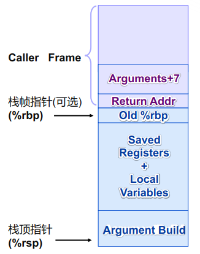

# 获取函数调用栈信息

## x86-64/Linux 函数调用规范

x86-64/Linux 下的栈帧如下图所示：



如图所示，当进行函数调用时，Caller 会将返回地址、栈帧指针 `rbp` 和无法通过寄存器传递的参数保存在栈上，并更新栈顶指针 `rsp` 寄存器为 Callee 分配栈帧，同时更新 `rbp` 寄存器使之指向新分配的栈帧。

设置 `RUSTFLAGS="-Cforce-frame-pointers=yes"` 使 rust 编译器启用栈帧指针。

## 获取函数调用栈信息

获取函数调用栈信息的代码如下：

```rust
fn print_stackframe() {
    let mut fp = rbp();
    let mut depth = 0;
    while fp != 0 && depth < STACKFRAME_DEPTH {
        println!("In stack frame: fp = {:#x}", fp);
        let frame_base = fp as *const u64;
        // old fp saved in `frame_base`
        let old_fp = unsafe { *frame_base };
        // ra saved in `frame_base + size_of::<u64>()`
        let ra = unsafe { *(frame_base.add(1)) };
        println!("    ra = {:#x}", ra);
        backtrace::resolve(ra as _, |s| {
            println!("    From caller: {:?}", s.name());
        });
        // backtrace to last frame
        fp = old_fp;
        depth += 1;
    }
}
```

在进入 `print_stackframe` 函数后，首先获取当前栈帧的 `rbp`，进而读取 Caller 在栈帧中保存的返回地址和 `rbp`。`backtrace::resolve` 函数用于解析返回地址，查询符号表以获得 Caller 的函数名。反复迭代回溯直到深度达到 `STACKFRAME_DEPTH`。

## 示例输出

采用如下实例程序进行测试：

```rust
fn main() {
    func1_inlined();
}

#[inline(always)]
fn func1_inlined() {
    func2();
}

fn func2() {
    func3();
}

fn func3() {
    print_stackframe();
}
```

其中 `func1_inlined` 为内联函数，不分配栈帧。`print_stackframe` 的输出结果如下：

```
In stack frame: fp = 0x7ffd9b30df90
    ra = 0x559cf53793e9
    From caller: Some(stackframe::func3::hb7a730e769236231)
In stack frame: fp = 0x7ffd9b30dfa0
    ra = 0x559cf53793d9
    From caller: Some(stackframe::func2::hdae0d2630d159c29)
In stack frame: fp = 0x7ffd9b30dfb0
    ra = 0x559cf53793c9
    From caller: Some(stackframe::func1_inlined::h2b1094ad00092c17)
    From caller: Some(stackframe::main::hea748d275a08e3f0)
In stack frame: fp = 0x7ffd9b30dfc0
    ra = 0x559cf5378c6e
    From caller: Some(core::ops::function::FnOnce::call_once::h5beee822a862637e)
In stack frame: fp = 0x7ffd9b30dfe0
    ra = 0x559cf5378fa1
    From caller: Some(std::sys_common::backtrace::__rust_begin_short_backtrace::h57085e4886a8a351)
In stack frame: fp = 0x7ffd9b30e010
    ra = 0x559cf5379484
    From caller: Some(std::rt::lang_start::{{closure}}::h8a87051ed4316868)
In stack frame: fp = 0x7ffd9b30e040
    ra = 0x559cf546175b
    From caller: Some(core::ops::function::impls::<impl core::ops::function::FnOnce<A> for &F>::call_once::hc10590404273ba9b)
    From caller: Some(std::panicking::try::do_call::hf8ee447d697a0711)
    From caller: Some(std::panicking::try::h402d78d0e0a061da)
    From caller: Some(std::panic::catch_unwind::h7fa80baa8711acb8)
    From caller: Some(std::rt::lang_start_internal::{{closure}}::h367ec8acd0735185)
    From caller: Some(std::panicking::try::do_call::hb0a149ff77040709)
    From caller: Some(std::panicking::try::h712c0d919136e071)
    From caller: Some(std::panic::catch_unwind::h96a8e65cff9345c6)
    From caller: Some(std::rt::lang_start_internal::he5c62c5d5c86a606)
```

可见 `print_stackframe` 回溯至了 rust 程序入口函数 `std::rt::lang_start_internal`。